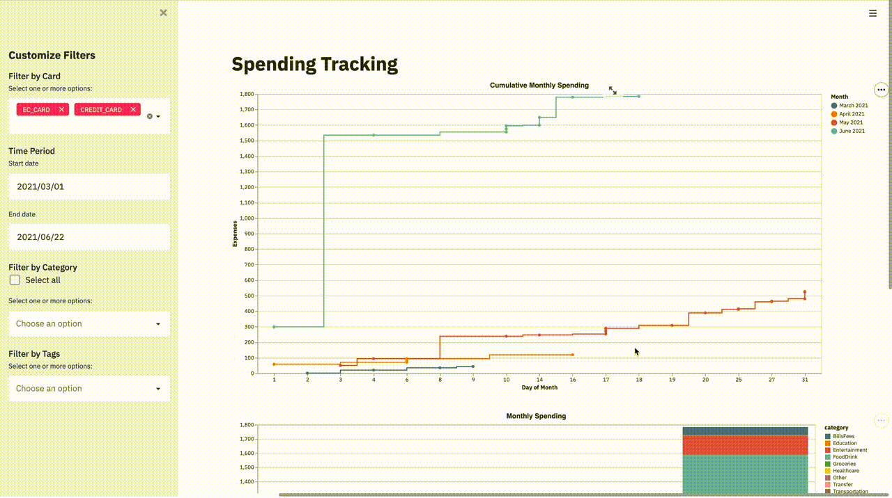

## Spending Tracking 

This repository is a WIP to replace expensive budgeting apps and get a more custom overview of one's spendings.

-----------------
It consists of the following pieces:
* Parsing of bank statements to extract transaction information
* Storing and retrieving data in postgres
* Interactive visualization using [Altair](https://altair-viz.github.io/) and [Streamlit](https://streamlit.io/)

#### Bank Statement Parsing
* Simple regex parsing for known bank statement layouts to extract line items
* See `parsing.statement_parsing.py` and `config.config.py` for details 


#### Data Storage
* Postgres database is run as docker image and data stored locally

#### User Input
* Categories are auto-assigned, based on common vendors/transaction descriptions
* User is prompted to input category and tags for unidentified categories

#### Visualization
* Data gets displayed and visualized in customizable graphs
* Assigning categories and tags as tedious as possible allows for fine-grained analysis 
* Graphs and streamlit interactions can be customized in `visualization.visualizations.py`



#### How to run
* Make sure postgres is up and running in the correct local port
* Navigate to the `src` folder
* For visualizing existing data run:
``` 
python main.py --visualize 
```
* For adding new data from an incoming bank_statement run:

```
python main.py --path [Path] --type [credit_card|ec_card] 
```

